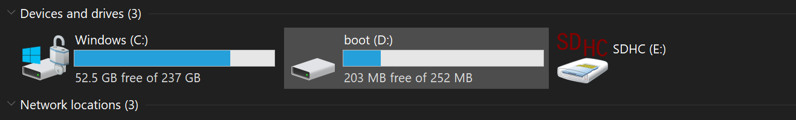
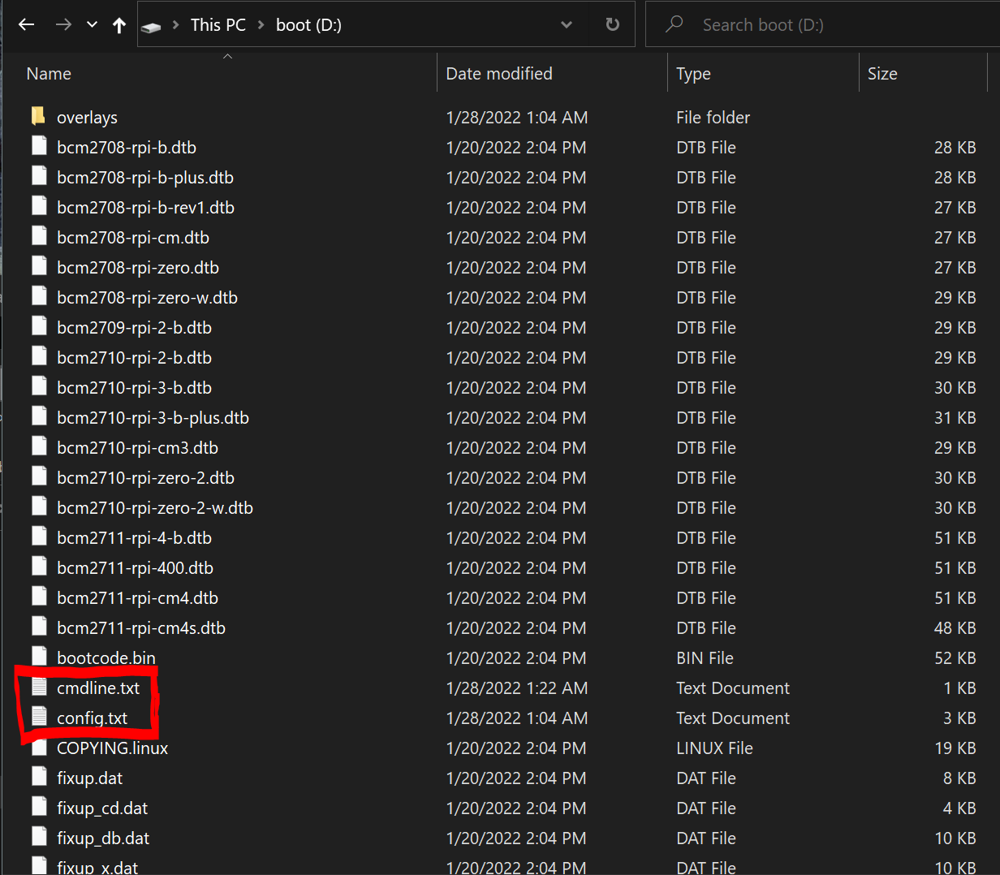
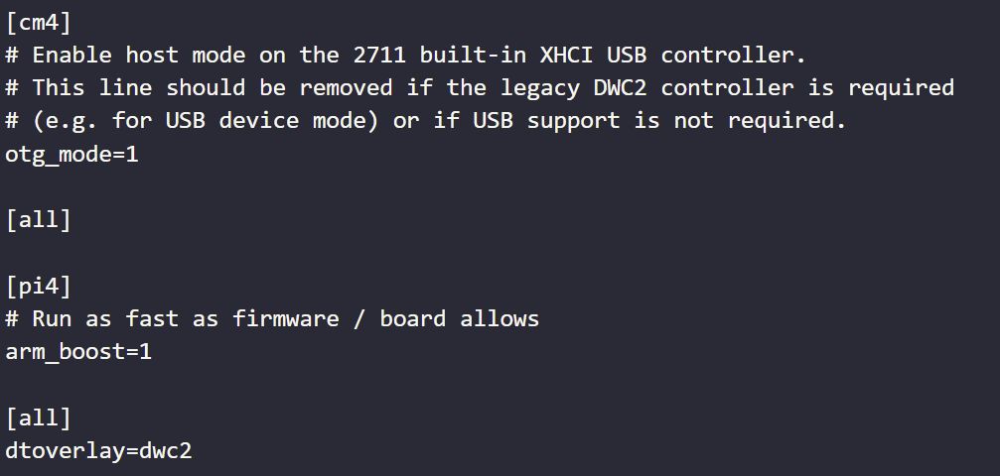
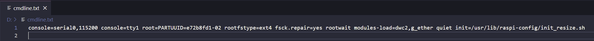
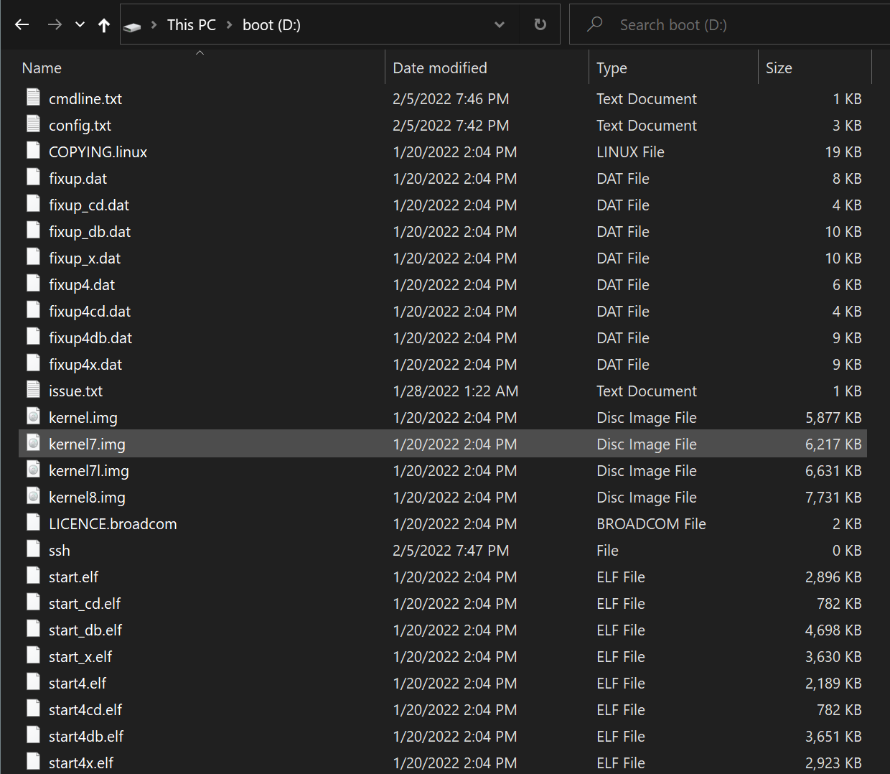

## Gadget Mode

First, we need to make some changes to the configuration files on the Raspberry Pi OS. This is best done by plugging the micro-SD drive into your PC and editing the files in the boot directory. The following image shows the boot directory in the Windows file explorer.&#x20;



When you enter the boot directory, it will look something like this:



Start by navigating to and opening `/boot/config.txt` and at the very end add the following: `dtoverlay=dwc2`. It should look something like this:



Then, edit `/boot/cmdline.txt` and add: `modules-load=dwc2,g_ether` after "rootwait." This file is particular about formatting and spacing, so take caution when editing this file. The contents of the file should all be on a single line with a single space between each option listed, as shown below.



Next, ensure that there is an empty file called `ssh` in the the `/boot/` directory. This is easiest done by navigating to the `/boot/` directory, right clicking -> new -> text document. Rename the text file to `ssh` with no extension. If successful, it will appear in the directory like so:



We have finished making the necessary changes to the OS. We can now replace the micro-SD into the Raspberry Pi and boot it up.&#x20;

***
## Connecting Through Windows

If you are connecting from a Windows PC, then the [Bonjour Print Services](https://support.apple.com/kb/DL999?locale=en_US) from Apple are needed to connect to the Raspberry Pi via ssh. Install and reboot your PC for the changes to take effect.

Finally, we can connect to the Raspberry Pi through ssh from the PC using:

```bash
ssh pi@raspberrypi.local
```

The `.local` extension is necessary to connect to usb connected devices.
***
