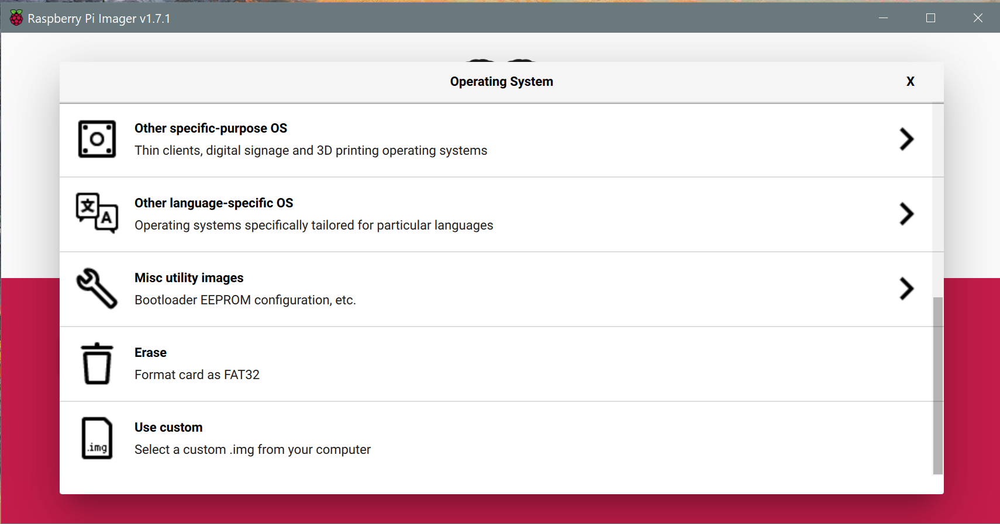

# Installing Raspian OS

When starting this project, there was a new release of the Raspian OS, which ran Python 3.9.2. I encountered an error when installing the RPi.GPIO package in this version. Therefore, I installed an older version of Raspian OS that ships with **Python 3.7.3** and was known to be stable.&#x20;

To install Raspian OS, I recommend using the Raspberry Pi Imager (link here). However, we need to find the older version of Raspian OS. This is located in the Raspberry Pi Foundation's archives [here](https://downloads.raspberrypi.org/raspbian_lite/images/). The version that was used in this project is the [`raspbian_lite-2020-02-14`](https://downloads.raspberrypi.org/raspbian_lite/images/raspbian_lite-2020-02-14/). Download and extract the file.&#x20;

Now, when running the Raspberry Pi Imager, there is an option to select a custom image file when you scroll to the bottom as seen below. Select the custom option and locate the extracted image from earlier. Then, select the appropriate SD card to write the image to and hit the `write` button.&#x20;

Now that Raspian OS is installed, move on to setting up [gadget mode](./gadget_mode.md) on the Raspberry Pi. This is easiest done with the SD card still connected to the PC.&#x20;
