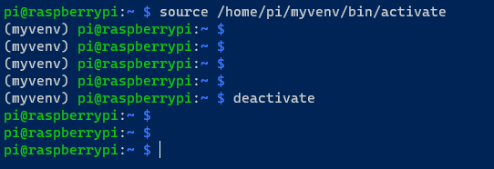
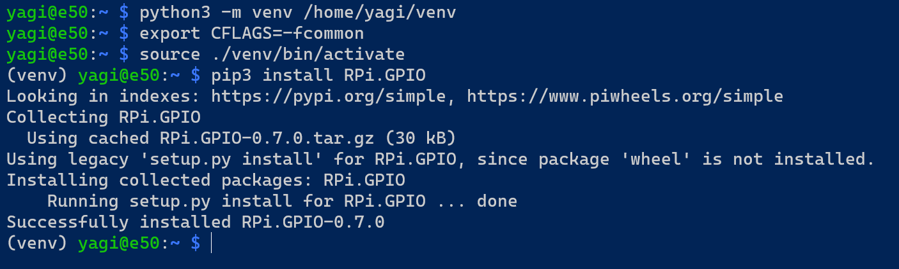

# Setting up Python on the Raspberry Pi

All of the coding done for this project used python. Before we begin running scripts on the Raspberry Pi, we need to make sure the environment is set and all the necessary python libraries are installed. The Raspberry Pi ran **python version 3.9.2**.

Most Raspberry Pis come with python installed. Ensure that python3 is installed on the Raspi. In the terminal, run the command `python3 --version`. If it returns with "Python 3.X.X", then python3 is already installed. We also need to install the `python3-dev` and `python3-venv` packages. All three can be installed using the following commands.

    sudo apt update
    sudo apt install python3 python3-dev

Next, check if pip3 is installed. In the same manner, in the terminal run `pip3 --version`. If it returns with a version number, then it is installed. If not, run:

    sudo apt install python3-pip

***

## Python Virtual Environments

It is generally a good idea to set up a python virtual environment. Though not entirely necessary, it is good to follow best practices and only takes a few minutes. Virtual environments allow us to set up a dedicated environment for our application that contains all the necessary packages. We will briefly go over setting up a virtual environment. Guides can also be found online.

First, install the python virtual environment package:

    sudo apt install python3-venv

To create a new environment, simply run:

    python3 -m venv /path/to/myvenv

    # for example
    python3 -m venv /home/ted/myvenv

where "myvenv" can be altered as desired.

Now, we need to activate the environment before we begin installing packages. This can be done using,

    source /path/to/myvenv/bin/activate

    # for example
    source /home/ted/myvenv/bin/activate

You will notice that the environment name will be shown in parantheses next to the user and hostname in the terminal window. To deactivate, simply run `deactivate`. The terminal will look something like this:

***

## Installing the packages

Once the environment is activated, we can install the necessary libraries. For this project, we only need the `RPi.GPIO` library. It can be installed using:

    pip3 install wheel
    pip3 install RPi.GPIO

The `RPi.GPIO` library will allow us to control the motor using the Raspberry Pi's general purpose input output pins.

***
NOTE: There seems to be a bug with Python version 3.9.2 and installing the RPi.GPIO package. It can be remedied by running `export CFLAGS=-fcommon` in the terminal before installing the RPi.GPIO library. An image is included of a successfull installation.

***

## Running the script

Now, when we run the script we need to call the python binaries from the environment that we created. All we have to do is call python from the folder where we created the environment. Refer to the main\_control.py script in this project to see how the motor control python scripts were executed. The following is an example of executing a python script with a specific environment:

    /path/to/venv/bin/python3 /path/to/script_file.py

    # following the previous examples
    /home/ted/myvenv/bin/python3 /path/to/script_file.py

This concludes the set up needed for python on the Raspberry Pi.
